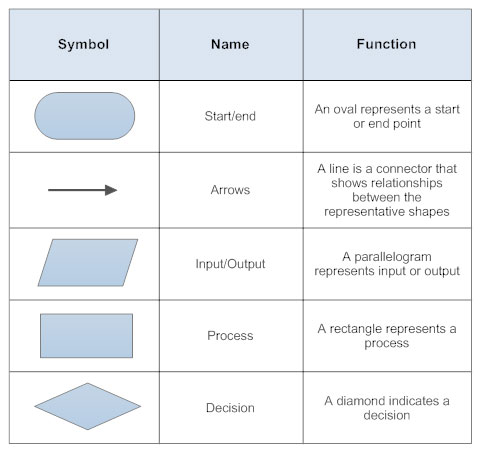

## Introduction 
Let's say this and put it out of the way. Algorithms are parts of computer science and mathematics and can perform calculations, data processing and automated reasoning tasks. You don't need to know maths to understand an algorithm **but it helps a lot**. Maths is to algorithms what a car is to a date-night, you don't really need it but if you have it you can wide the range of your choices. 

## What is an algorithm
Before you start to code you will need to understand how important are algorithms. Now to understand how important they are you will need to set a goal that you want to achieve and examine the bare minimum steps and the way to do it. For example, if you were to right down your morning routine you wouldn't right every single thing that you do to get up, right? Maybe, MAYBE, you would right everything if you were keeping a journal, but for the mortal soul that you would go something like "I get up, go to the bathroom, wash my teeth and have breakfast". Now correct me if im wrong but that there is an algorithm, right? It has the bare minimum steps and the way to do them.

Now that we've explain practically what algorithms are let's focus on how to present or express one.

## How to express an algorithm
Begining our fast crash course an algorithm can be expressed in one of three ways; using a **Flow Chart**, using **Natural Language** or by using **Pseudocode** (now there are a few more ways but these ones are the simplest).

### Natural Languge
By using natural languge you are using a human language to explain your steps. Plain and easy using your native tongue (or whatever langugage you want to use)

### Pseudocode
Pseudocode is something between a programm and a human language. To be more percise, it uses programming principles and the human language to write a program that a human will be able to read and not a machine.

## Flow chart
So a flow chart is a represetation of an algorithm in an image using a specific set of shapes. If that didn't make much sense just remember the following image, we will return to it later.



## Parts of an algorithm
An algorithm has **parameters**, **variables**, **functions**, **conditionals** and **loops**.

*    Parameters: A parameter is a varible with a static value (a value that doesn't change)
*    Variable: A variable is a symbol, usually a letter or a word, that can change values
*    Fuction: Funtions are expressions or relations that contain one or more variables
*    Condiotional: A conditional is a decision where the computer executes a part of the code, if the conditions are met. 
*    Loops: Loops are conditionals that execute part of the code multiple times.

NOTE: We will not say much about while loops and conditionals because we will go more in depth about the types and how they work when we get to the introductions of the languages.

## Examples
Now we will create an algorithm and represent it with a flowchart using everithing that we have said. The algorithm is the calculation of the quadratic formula.

NOTE: the messege after the hashtag sign(#) means there is a comment, it's not meant to be executed.

```
Start #start algorithm
Print "Give me your three numbers (a,b,c): " 
Input a,b,c
if a < 0 then         #this is the start of a conditional
 while a < 0 do                       #checks if a is a negative number and if it is it repeats the input process
   Print "value 'a' is not correct"     
   Print "Give me your three numbers (a,b,c): "
   Input a,b,c
  end                 #this is the end of the while loop
end_if                #this is the end of a coditional
d<- sqrt(b^2 -4*a*c)
x1<- (-b+d)/(2*a)
x1<- (-b-d)/(2*a)
Print(x1,x2)
End #end algorithm
```


## Epilogue 
We could be talking about algorithms for hours but I have dedicated a whole site to talk on so much more than just algorithms. If you want more I suggest to go in depth with [Khan academy's Introduction to Algorithms](https://www.khanacademy.org/computing/computer-science/algorithms) or read Steven Skiena's "The Algorithm Design Manual".
