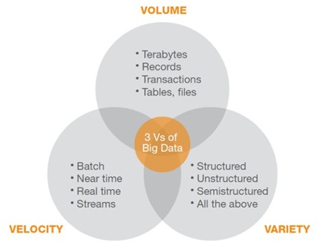

## Introduction
 Programming languages are often used to analyse data. Given the **RISE** of the social media and 
other technologies, the data that the common user provides to a server have sky-rocketed and now the recent methods of analysis are not enough. This means that most of the data that we have to analyse now as Data Scientists and Developers are way too many for our common computers.


 Because of the increase of data there has been a new term on the rise, Big Data. So the main 
question is "What is Big Data?"

## Big Data
 Big Data is a term which decribes 3 core concepts; High speed of data transfer (Velocity), Huge 
amounts of data (Volume) and a big number of variebles and types of data (Variety), they are also known as **The Three V** (3 V's).



 Now you can read hours upon hours on what other Vs there are, like "Visualization" and 
"Variability", but this won't get you anywhare if you haven't had expirience with the 3 core ones. 

Here I will suggest a few methods and technologies, if you ever get Big Data in your hands.

## Data Science Methods
 Let's start the practical tools by going back to a branch called 'Data Science' in which we have 
the 'Data' also known as 'Warehousing' and the 'Science' part where we can find diffrent methods of analysis. Here we will be explaining quickly some methods that are used in the 'Science' part.

### Spliting your data
 One of the greatest ways to analyse data is by splitting data in chuncks, that way no matter how
big they are, you will be able to do your analysis in time.

Python example:
```
data=range(1,100)
train_data = data[:50]
test_data = data[50:]
```

R example
```
data=seq(1,100)
train_data = [data, ]
test_data = [-data, ]
```

### Aggregation
 If you feel adventurous, your analysis doesn't need to be very precise and you know how to  
calculate residual errors, then aggregation is for you. Also, aggregating your data means that the main reason you can't do an analysis is because of the amount of RAM, which is too small.

Python example:
```
import iris
import iris.coord_categorisation

filename = iris.sample_data_path('ostia_monthly.nc')
cube = iris.load_cube(filename, 'surface_temperature')

iris.coord_categorisation.add_season(cube, 'time', name='clim_season')
iris.coord_categorisation.add_season_year(cube, 'time', name='season_year')

annual_seasonal_mean = cube.aggregated_by(
['clim_season', 'season_year'],
iris.analysis.MEAN)
```

R example:
```
attach(mtcars)
aggdata <-aggregate(mtcars, by=list(cyl,vs), 
FUN=mean, na.rm=TRUE)
```

### Parallel Computing
Now, if you want to use parallel computing and split the process into the cores of your CPU that's great, kudos to you, but you need to remember that parallel computing is used when the data are big in volume or the model that you are using is way too slow.

[Python example](https://github.com/KarlesP/Parallel_process_with_pyhton)

[R example](https://github.com/KarlesP/Parallel-Programming)


## Technologies and Warehousing
We've talked about how to manipulate your data, now let's talk about the databases that you should  be using.
There is a branch in Computer Science called Distributed Computing and what you can do is split your data into multiple storage facilities (servers, computers, Raspberry Pis) and then analyse them, whenever you want, without having troubles like analysing gigabites of data. One of the ways to do that is by using Hadoop with Pig or Hive. Now, Hadoop was created in Java so in order to debug it, in case there is a bug to fix, you will need to learn Java. Luckily we have an introduction to Java in the main page as well as a Hadoop introduction.
Alternatively, if you want to use something else, other than Hadoop which is a NoSQL database you can find, but Hadoop is free and is a good starter if you have a few computers lying around (or at least two).

## Epilogue
Big data has many applications but in order to use it you'll need to learn it by yourself, fortunately you are a developer which means you are most likely used to that already. Also if you want to take up the challenge that is called "Big Data" go ahead, I support you, but it's not easy (at least at the current year, which is 2018)
