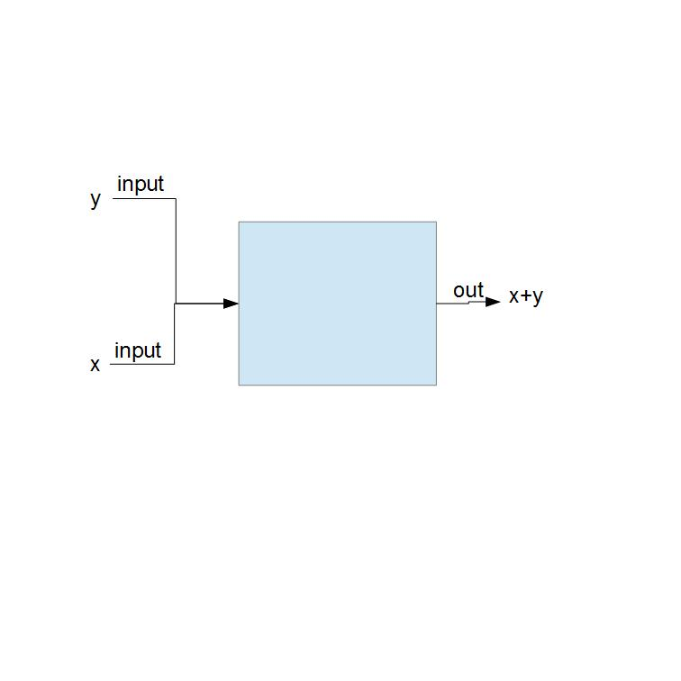
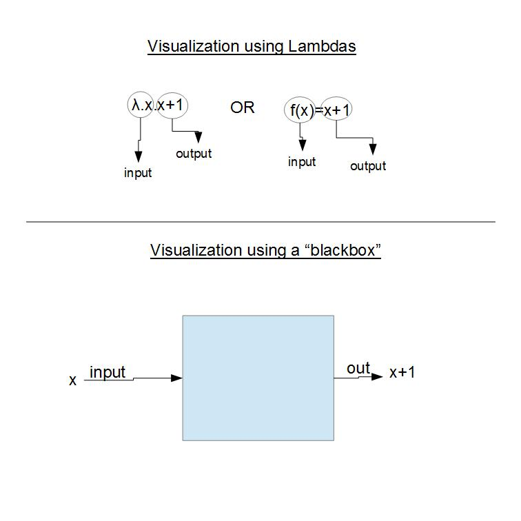
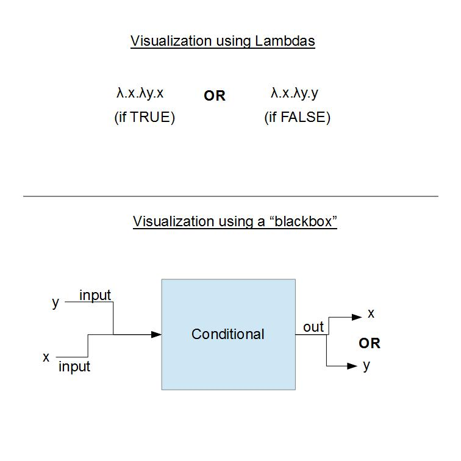

## Prologue
If you are here you either want to learn more about function **OR** you want to learn what is Lambda-calculus (λ-calculus). Now, let's be honest, if you are here you want to know the general idea of lambda calculus

## Introduction
In the 1930s Alonzo Church wanted to create a universal model of computation that can be used to simulate any Turing machine. With λ-calculus he was able to provide a theoretical way to create those simulations.

Now, in order to understand what λ-calculus is, you need to imageine a blackbox that takes two inputs and "spits out" an output, a result. That blackbox is the function (clearly).



Now that you know all that let's explain how you can present it.

## Representation and lambdas
Now you would want to find a way to represent those functions (naturally) so take a look at the following example



here we have "λ.x" which is "f(x)", if we are going to use Calculus terminology, and "x+1" which is the calculation that would take place with our input. So if we want to apply that function and input the value 5 we will get something like:
```
(λ.x.x+1)5=5+1=6
```

Now that we are familiar with our calculations, let's create a conditional.

## Create a conditional
Given that we already know how calculations are represented using Lambdas it is only natural to see how we can create a conditional. So for this example we know that **x** is **TRUE** and **y** is **FALSE**. If you look at the next image you will see how we can construct such function/



## Epilogue
Lambda Calculus is a fancy way to write functions, which is great but it is not as practical. For the time being, lambda calculus is amazing but as a branch of mathematical logic, other than that it's not practical but in my opinion is essential. 

What I have said here is not much, but it will get you started. If you want to further your education I suggest "A lambda calculus for quantum computation" from Tonder A (2004), which does an amazing explanation in the first two chapters, as well as "Functional programming and lambda calculus" from Barendregt HP (1990) which isn't a very recent paper but it showcases the mathematical nature of lambda-calculus.
