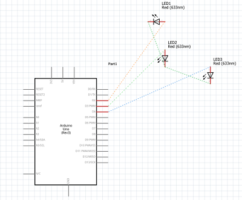

## Introduction
Let's say that you want to create a project using arduino but you want to create a schema of your work. To do that you will need a
program that allows you to create microelectronic schemas. Fritzing is an open-source hardware initiative that makes electronics accessible as a creative material for anyone.

To start working with fritzing you will need to go online and download it from [**Here**](http://fritzing.org/download/). Now if you want additional parts you can go to their website [**Here**](http://fritzing.org/parts/) and find what you need.

## Example (LED showdown)
### Code (Arduino)
```
void setup() 
{
digitalWrite(2, LOW);
digitalWrite(3, LOW);
digitalWrite(4, LOW);
}

void loop() 
{
  digitalWrite(2, HIGH);
  delay(1000);
  digitalWrite(3, HIGH);
  delay(1000);
  digitalWrite(4, HIGH);
  delay(1000);
  digitalWrite(4, HIGH);
  delay(1000);
  digitalWrite(3, HIGH);
  delay(1000);
  digitalWrite(2, HIGH);
  delay(1000);
}
```


### Schematics 

<div align="center">
  
</div>

## Epilogue
Now that you have download it the only thing that you will have to do is find a project and it's Schema and start from there. For example you can download [this project](http://fritzing.org/projects/motion-detector-lcd) and start creating a motion detector with an Arduino Uno R3.
