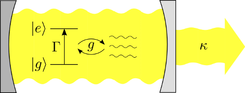

## Prologue
Let's learn QuTiP! So, Quantum Toolbox in Python (a.k.a QuTiP) is a module in python which allows you to work with quantum mechanics problems.
Now, I am no Quantum mechanic but here you can find a sample code for you to run on your machine and it is written in python. The code was first written by the author of the module but some of his commands where outdated in Python 3 so I changed them.

## Introduction:
The following commands are edited from the Lecture 2B of J R Johansson named "Single Atom Lasing using QuTiP". For more info on the author of the QuTiP module visit [his github](https://github.com/jrjohansson) or [his lectures](http://jrjohansson.github.io/computing.html) which are open for everyone. If you want to know about the problem go [HERE](http://nbviewer.jupyter.org/github/jrjohansson/qutip-lectures/blob/master/Lecture-2B-Single-Atom-Lasing.ipynb)



So, fist up you need to pip install "matplotlib", "numpy" and "qutip" which are the three modules that we will use, if you are using the Spyder IDE, which comes with Anaconda, then even better because you will only need to install "qutip" (that is because Spyder comes with Scipy, see "Python for SCIENCE!" from the index page)
If you don't know how to install a Python module use the best search engine that you can find and search for it
OR use the Spyder IDE and [**this link**](https://stackoverflow.com/questions/10729116/adding-a-module-specifically-pymorph-to-spyder-python-ide)

Now that you installed the module let's begin by importing the modules:

```
import matplotlib.pyplot as plt
import matplotlib as mpl
import numpy as np
import qutip as qu
```

Next step is to create our parameters, that way we can change them and compare the results later:
```
w0 = 1.0  * 2 * np.pi  # cavity frequency
wa = 1.0  * 2 * np.pi  # atom frequency
g  = 0.05 * 2 * np.pi  # coupling strength

kappa = 0.04        # cavity dissipation rate
gamma = 0.00        # atom dissipation rate
Gamma = 0.35        # atom pump rate

N = 50              # number of cavity fock states
n_th_a = 0.0        # avg number of thermal bath excitation

tlist = np.linspace(0, 150, 101)
```

Now, let's setup the operators, the Hamiltonian and initial state:
```
# intial state
psi0 = qu.tensor(qu.basis(N,0), qu.basis(2,0)) # start without excitations

# operators
a  = qu.tensor(qu.destroy(N), qu.qeye(2)) #for refrence; from "qu" module take the "tensor" function, the destroy function and the eye function
sm = qu.tensor(qu.qeye(N), qu.destroy(2))
sx = qu.tensor(qu.qeye(N), qu.sigmax())

# Hamiltonian
H = w0 * a.dag() * a + wa * sm.dag() * sm + g * (a.dag() + a) * sx
```

After that let's create a list of collapse operators that describe the dissipation:
```
# collapse operators
c_ops = []

rate = kappa * (1 + n_th_a)
if rate > 0.0:
    c_ops.append(np.sqrt(rate) * a)

rate = kappa * n_th_a
if rate > 0.0:
    c_ops.append(np.sqrt(rate) * a.dag())

rate = gamma
if rate > 0.0:
    c_ops.append(np.sqrt(rate) * sm)

rate = Gamma
if rate > 0.0:
    c_ops.append(np.sqrt(rate) * sm.dag())
    
#'Evolve the system    
opt = qu.Odeoptions(nsteps=2000) # allow extra time-steps 
output = qu.mesolve(H, psi0, tlist, c_ops, [a.dag() * a, sm.dag() * sm],   options=opt)
#'Visualize the results
n_c = output.expect[0]
n_a = output.expect[1]

fig, axes = plt.subplots(1, 1, figsize=(8,6))

axes.plot(tlist, n_c, label="Cavity")
axes.plot(tlist, n_a, label="Atom excited state")
axes.set_xlim(0, 150)
axes.legend(loc=0)
axes.set_xlabel('Time')
axes.set_ylabel('Occupation probability');
```
Here we will need more explanation because it is really important to understand that NOW we are cooking with quantum mechanics.
So, now that we've done all that we are going to test their Steady state which is what a quantum state is independent from time, now to explain 
that with maths it will take more space...which I don't have, so let's continue

Here we are going to plot the steady state of the atom through the cavity fock-state distribution and the wigner function:
```
rho_ss = qu.steadystate(H, c_ops)
fig, axes = plt.subplots(1, 2, figsize=(12,6))

xvec = np.linspace(-5,5,200)

rho_cavity = qu.ptrace(rho_ss, 0)
W = qu.wigner(rho_cavity, xvec, xvec)
wlim = abs(W).max()

axes[1].contourf(xvec, xvec, W, 100, norm=mpl.colors.Normalize(-wlim,wlim),
    cmap=plt.get_cmap('RdBu'))

axes[1].set_xlabel(r'Im $\alpha$', fontsize=18)
axes[1].set_ylabel(r'Re $\alpha$', fontsize=18)

axes[0].bar(np.arange(0, N), np.real(rho_cavity.diag()), color="blue", 
    alpha=0.6)

axes[0].set_ylim(0, 1)
axes[0].set_xlim(0, N)
axes[0].set_xlabel('Fock number', fontsize=18)
axes[0].set_ylabel('Occupation probability', fontsize=18);
```

Following that we will now visualize the cavity fock-state distribution and Wigner function as a function of time:
```
tlist = np.linspace(0, 25, 5)
output = qu.mesolve(H, psi0, tlist, c_ops, [], 
                    options=qu.Odeoptions(nsteps=5000))

rho_ss_sublist = output.states

xvec = np.linspace(-5,5,200)

fig, axes = plt.subplots(2, len(rho_ss_sublist), 
                         figsize=(3*len(rho_ss_sublist), 6))

for idx, rho_ss in enumerate(rho_ss_sublist):

    # trace out the cavity density matrix
    rho_ss_cavity = qu.ptrace(rho_ss, 0)
    
    # calculate its wigner function
    W = qu.wigner(rho_ss_cavity, xvec, xvec)
    
    # plot its wigner function
    wlim = abs(W).max()
    axes[0,idx].contourf(xvec, xvec, W, 100, norm=mpl.colors.Normalize(-wlim,
        wlim), cmap=plt.get_cmap('RdBu'))
    axes[0,idx].set_title(r'$t = %.1f$' % tlist[idx])
    
    # plot its fock-state distribution
    axes[1,idx].bar(np.arange(0, N), np.real(rho_ss_cavity.diag()), 
        color="blue", alpha=0.8)
    
    axes[1,idx].set_ylim(0, 1)
    axes[1,idx].set_xlim(0, 15)

```

After that we will attempt to visualize the average photon occupation in cavity as a function of pump rate based on the Ashhab S. et al (2008) paper:
```
def calulcate_avg_photons(N, Gamma):
       
    # collapse operators
    c_ops = []

    rate = kappa * (1 + n_th_a)
    if rate > 0.0:
        c_ops.append(np.sqrt(rate) * a)

    rate = kappa * n_th_a
    if rate > 0.0:
        c_ops.append(np.sqrt(rate) * a.dag())

    rate = gamma
    if rate > 0.0:
        c_ops.append(np.sqrt(rate) * sm)

    rate = Gamma
    if rate > 0.0:
        c_ops.append(np.sqrt(rate) * sm.dag())
      
    # Ground state and steady state for the Hamiltonian: H = H0 + g * H1
    rho_ss = qu.steadystate(H, c_ops)
    
    # cavity photon number
    n_cavity = qu.expect(a.dag() * a, rho_ss)
    
    # cavity second order coherence function
    g2_cavity = qu.expect(a.dag() * a.dag() * a * a, rho_ss) / (n_cavity ** 2)

    return n_cavity, g2_cavity
Gamma_max = 2 * (4*g**2) / kappa
Gamma_vec = np.linspace(0.1, Gamma_max, 50)

n_avg_vec = []
g2_vec = []

for Gamma in Gamma_vec:
    n_avg, g2 = calulcate_avg_photons(N, Gamma)
    n_avg_vec.append(n_avg)
    g2_vec.append(g2)
fig, axes = plt.subplots(1, 1, figsize=(12,6))

axes.plot(Gamma_vec * kappa / (4*g**2), n_avg_vec, color="blue", alpha=0.6, 
          label="numerical")

axes.set_xlabel(r'$\Gamma\kappa/(4g^2)$', fontsize=18)
axes.set_ylabel(r'Occupation probability $\langle n \rangle$', fontsize=18)
axes.set_xlim(0, 2);

fig, axes = plt.subplots(1, 1, figsize=(12,6))

axes.plot(Gamma_vec * kappa / (4*g**2), g2_vec, color="blue", alpha=0.6, 
          label="numerical")

axes.set_xlabel(r'$\Gamma\kappa/(4g^2)$', fontsize=18)
axes.set_ylabel(r'$g^{(2)}(0)$', fontsize=18)
axes.set_xlim(0, 2)
axes.text(0.1, 1.1, "Lasing regime", fontsize=16)
axes.text(1.5, 1.8, "Thermal regime", fontsize=16);
``` 

Now we are going to study 2 cases at the fock-state distribution at lasing regime (Case 1) and suppressed regime (Case 2):
```
#'Case 1: Gamma/(4*g²)=0.5 

Gamma = 0.5 * (4*g**2) / kappa
c_ops = [np.sqrt(kappa * (1 + n_th_a)) * a, np.sqrt(kappa * n_th_a) * a.dag(), 
         np.sqrt(gamma) * sm, np.sqrt(Gamma) * sm.dag()]

rho_ss = qu.steadystate(H, c_ops)
fig, axes = plt.subplots(1, 2, figsize=(16,6))

xvec = np.linspace(-10,10,200)

rho_cavity = qu.ptrace(rho_ss, 0)
W = qu.wigner(rho_cavity, xvec, xvec)
wlim = abs(W).max()
axes[1].contourf(xvec, xvec, W, 100, norm=mpl.colors.Normalize(-wlim,wlim), 
    cmap=plt.get_cmap('RdBu'))

axes[1].set_xlabel(r'Im $\alpha$', fontsize=18)
axes[1].set_ylabel(r'Re $\alpha$', fontsize=18)

axes[0].bar(np.arange(0, N), np.real(rho_cavity.diag()), color="blue", 
            alpha=0.6)

axes[0].set_xlabel(r'$n$', fontsize=18)
axes[0].set_ylabel(r'Occupation probability', fontsize=18)
axes[0].set_ylim(0, 1)
axes[0].set_xlim(0, N);

#'Case 2: Gamma/(4*g²)=1.5
Gamma = 1.5 * (4*g**2) / kappa
c_ops = [np.sqrt(kappa * (1 + n_th_a)) * a, np.sqrt(kappa * n_th_a) * a.dag(), 
        np.sqrt(gamma) * sm, np.sqrt(Gamma) * sm.dag()]

rho_ss = qu.steadystate(H, c_ops)
fig, axes = plt.subplots(1, 2, figsize=(16,6))

xvec = np.linspace(-10,10,200)

rho_cavity = qu.ptrace(rho_ss, 0)
W = qu.wigner(rho_cavity, xvec, xvec)
wlim = abs(W).max()
axes[1].contourf(xvec, xvec, W, 100, norm=mpl.colors.Normalize(-wlim,wlim), 
                 cmap=plt.get_cmap('RdBu'))

axes[1].set_xlabel(r'Im $\alpha$', fontsize=18)
axes[1].set_ylabel(r'Re $\alpha$', fontsize=18)

axes[0].bar(np.arange(0, N), np.real(rho_cavity.diag()), color="blue", 
            alpha=0.6)
axes[0].set_xlabel(r'$n$', fontsize=18)
axes[0].set_ylabel(r'Occupation probability', fontsize=18)
axes[0].set_ylim(0, 1)
axes[0].set_xlim(0, N);
```
## Epilogue
After all that you won't be able to call yourself a Quantum Mechanic but you will have a liitle bit more expirience with the applications of Python.
