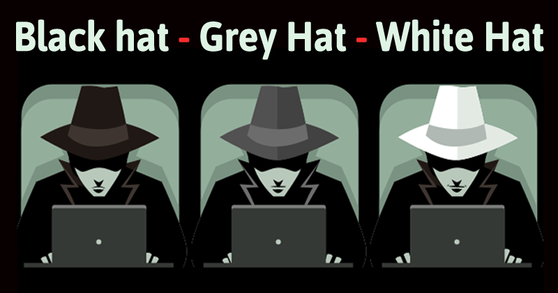

## Introduction
> Note: This file and the following 3 (Pearl, Kali, Shellscript) have been created so I can showcase my knowledge on PenTest. Otherwise they are here **for educational purposes**.

In the recent years Penetration Testing (PenTesting) has seen an increase because of the media and that's not a bad thing. You see PenTesting is what we used to call "Hacking" in the early 90's and 80's. Here I will explain what PenTesting means in practice and share a peace of my mind about it.

Note: From now on every *system* is either a system of people (transmitter-receiver), a computer system (computer-server) or a system between a user and a computer.

## What is PenTesting and the diffrences between "hats"
Practically PenTesting has 5 stages:

1. Scan a system for vulnerabilities
2. Exploit those vulnerabilities
3. Create a connection (Backdoor)
4. Maintain that connection
5. Secure the system and delete the backdoor

Now if you exclude the last part, everything else is basically *illegal* if you don't have the consent of the admin or from the user, depending on the system. But what was that at the title about hats?

### ...something about hats
When we are talking about people who can exploit a system's vulnerabilities we are talking about three categories of people; Whitehats, Greyhats, Blackhats. The simplest way to distinguish one from the other is from the ethics of each individual. If you are using not ethics and use PenTesting tools to steal, damage and duplicate someone else's content you are a Blackhat, if you are using ethics and use the same tools to make the web a safer place by securing any vulnerability that you find you are a Whitehat, if you are using a little bit of both but you aren't as skilled you are a Greyhat, because bassically you are helping without someone's permission.  

  

## The Basics
Before you begin your quest to learn pentest you will need to learn 3 things:

1. What is TCP/IP
2. How workarounds and diffrent techniques...work
3. How to do research and not just googling

If you are having trouble teaching yourself one of them, don't worry you need prac

## Practice 
Now that you followed every step here and learned every-single-thing what do you do? The answer is simple; CTF contests or PenTest boxes.

### CTF
Starting with CTF (Capture The Flag) contests are competitive games where you can actually hack your way around a system using only a computer and everything that you've learned so far. But to give you a perspective, it is usually a machine that you connect through a safe network, from there you have to use PenTest tools to exploit diffrent security vulnerabilities and find specific series of numbers, which are called "flags", find all of them and you win the contest.

### PenTest boxes
PenTest boxes are safe, online environments where you can practice your skills.

## PenTest and programming
Usually when we are talking about PenTest we're not talking about programming, but you will need to learn how to code in a few languages so you can understand things like how a website works or how a database works. Other than that you will need to learn what Social Engineering is in practice, which is bassically how to con people.

## Starting up
If you want to start right away you should look towards a Linux OS like Kali, Black Arck or Parrot Security and look for CTF workarounds, other than that look for a [CTF challenge](http://captf.com/practice-ctf/) or a PenTest lab like [this one](https://www.hackthebox.eu/).

## Reading material and practices
+ [Kalo Linux ebook](https://www.kali.org/download-kali-linux-revealed-book/)
+ [High Performance Browser Network](https://hpbn.co/)
+ [BlackArch Guide](https://blackarch.org/guide.pdf)
